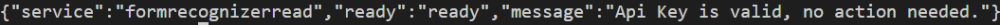

# Containerize Doc intelligence

## Environment

```bash	
export AKS_RESOURCE_GROUP=<your resource group>
export AKS_CLUSTER_NAME=<your cluster name>
export NAMESPACE=doc-intelligence
export BILLING_ENDPOINT=<your billing endpoint>
export API_KEY=<your api key>
```	

## Get AKS credentials

```bash
az aks get-credentials --resource-group $AKS_RESOURCE_GROUP --name $AKS_CLUSTER_NAME
```

## Create namespace

```bash
kubectl create namespace $NAMESPACE
```

## Example 1: Deploy single feature (Read)

### Apply yaml

```bash
sed -e "s|\$BILLING_ENDPOINT|"$BILLING_ENDPOINT"|g" -e "s|\$API_KEY|"$API_KEY"|g" k8s/read-application.yaml | kubectl apply -f - -n $NAMESPACE
```

NOTE: resource request and limits are not set in the yaml file. You can set them by adding the following lines to the yaml file under `spec.template.spec.containers`:

```yaml
resources:
  requests:
    cpu: 8
    memory: 10Gi
  limits:
    cpu: 8
    memory: 24Gi
```

See this doc for sizing: https://learn.microsoft.com/en-us/azure/ai-services/document-intelligence/containers/install-run?view=doc-intel-3.0.0&tabs=read#document-intelligence-containers

### Get logs
    
```bash
kubectl logs -f -l app=doc-intelligence-read -n $NAMESPACE
```

### Test endpoints

Get service IP

```bash
export SVC_IP=$(kubectl get svc doc-intelligence-read -n $NAMESPACE -o jsonpath='{.status.loadBalancer.ingress[0].ip}')
```
Get status:

```bash
curl http://$SVC_IP/status
```


Is ready:

```bash
curl http://$SVC_IP/ready
```



## Example 2: Deploy feature + supporting containers (General Doc + Layout)

### Apply yaml

```bash
sed -e "s|\$BILLING_ENDPOINT|"$BILLING_ENDPOINT"|g" -e "s|\$API_KEY|"$API_KEY"|g" k8s/general-doc-application.yaml | kubectl apply -f - -n $NAMESPACE
```

### Get logs
    
```bash
kubectl logs -f -l app=general-document -n $NAMESPACE
```

and 
  
```bash 
kubectl logs -f -l app=layout -n $NAMESPACE
```

### Test endpoints

Get service IP

```bash
export SVC_IP=$(kubectl get svc general-document -n $NAMESPACE -o jsonpath='{.status.loadBalancer.ingress[0].ip}')
```

Get status:

```bash
curl http://$SVC_IP/status
```

Is ready:

```bash
curl http://$SVC_IP/ready
```

Or navigate to http://$SVC_IP/ in your browser:


